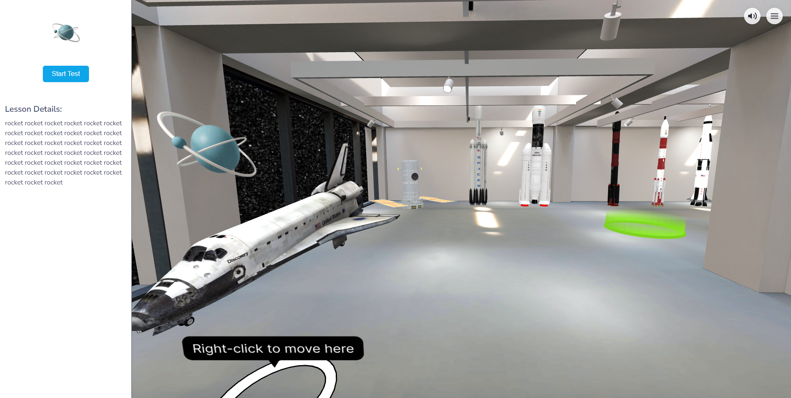
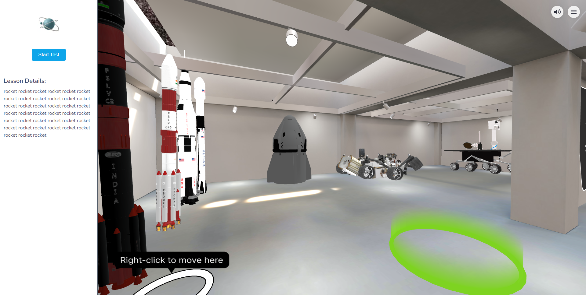
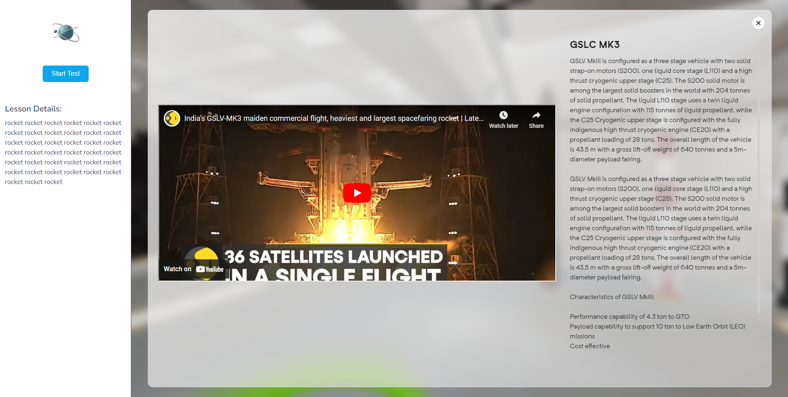
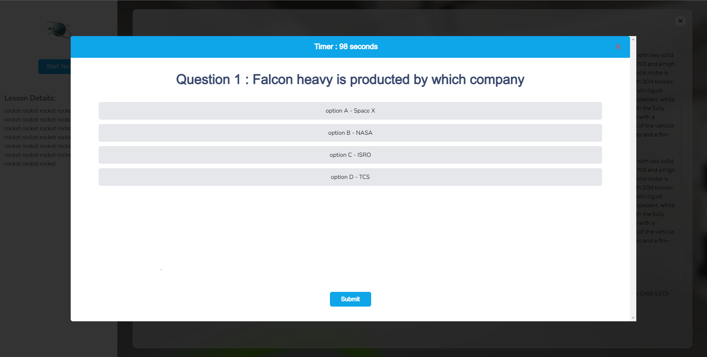
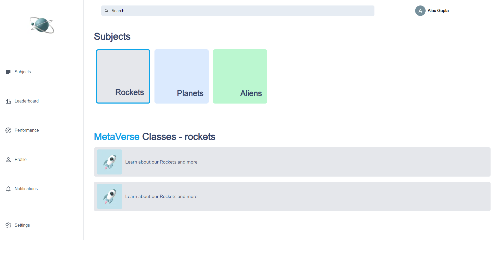

## Astro Verse:  A Step into the Future of Science Education: The Metaverse for Engaging and Interactive Learning.

# Problem

🚀 Traditional methods of learning about space 🚀, rockets 🚀, hovers 🚁, and telescopes 🔭, such as books 📚 and YouTube videos 📹, can be unengaging and tedious for students, resulting in limited opportunities for effective learning and making it challenging for them to comprehend new concepts.

👎 This issue can lead to disinterest in the subject matter, lack of motivation, poor academic performance, and missed learning opportunities.

💡 To address this problem, there is a need to explore innovative and more interactive teaching methods, such as virtual reality simulations 🎮 and interactive workshops 🎓, that can create a more dynamic learning environment and engage students, leading to improved academic outcomes and a greater interest in the subject matter.

# Solution

🌐 To address the issue of unengaging and ineffective traditional learning methods for space-related concepts, we propose introducing an Open-World Metaverse, specifically designed for students.

🎓 Our Metaverse offers a dynamic and interactive learning experience, where students can explore freely, interact with educational concepts, and reinforce their understanding by answering multiple-choice questions.

💰 To enhance students' motivation, correct answers are rewarded with virtual coins 💰 that can be used within the virtual world.

🚀 This innovative solution creates a fun and engaging atmosphere that promotes active participation and curiosity among students.

🔍 By leveraging this technology, students can enjoy an immersive and interactive learning experience, enhancing their academic outcomes and fostering a deeper interest in the subject matter.